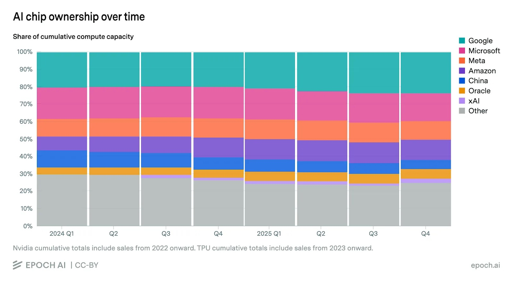
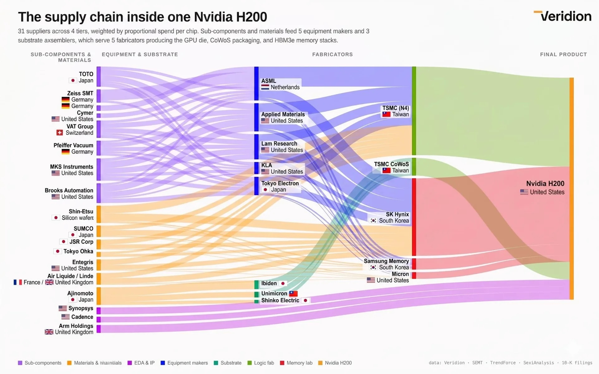

## AI Supply Chain Summary
# AI Supply Chain

A beginner and Taiwan-specific exploration of how the AI industry fits together — from models down to the hardware that powers them.

## Why This Topic First?

- Understand the basic terms commonly used in AI
- Understand where Taiwan's semiconductor industry sits in the AI supply chain
- Serve as a starting point for thinking about what role to play in AI
- Inform future investment considerations

## The Supply Chain Layers

### 1. Model

**Description:** Transform data with algorithms to compute (tokens)

**Components:**
- Training
- Inference

**Main Players (Frontier AI labs):**
- 🇺🇸 USA: OpenAI, Anthropic, Grok, Google (?)
- 🇪🇺 Europe: Mistral
- 🇨🇳 China: DeepSeek, Alibaba (Qwen)

### 2. Data Center

**Description:** The infrastructure to develop and maintain AI models

**Components:**
- Advanced chips (GPUs, TPUs, etc.)
- Server racks
- Electricity

**Main Players:** Google, Amazon, Microsoft, Meta



### 3. Hardware Manufacturing (Where Taiwan Shines 🇹🇼)

**GPU production pipeline:**

```
Design → Foundry (Fabrication) → Advanced Packaging
```

| Stage | Key Players |
|---|---|
| Design | Nvidia, AMD, Intel |
| Foundry — Compute/Logic | TSMC |
| Foundry — HBM (High-Bandwidth Memory) | SK Hynix, Samsung, Micron |
| Advanced Packaging | TSMC, ASE |

**AI Server Assembly**

Components integrated into a server:
- Accelerators: GPU, TPU, NPU
- CPU
- RAM
- SSD
- Power and cooling
- High-speed networking

**Main Players:** Foxconn, Wistron, Quanta, Compal, Inventec



## Homework

- [ ] Get familiar with technical terms
- [ ] Think about: what roles should I play in the game?
- [ ] Start thinking about topics that demonstrate understanding of the industry (useful for interviews)
- [ ] Find readings to share
- [ ] Prep for next session: **Salary**

## References

- [A Beginner's Guide to the AI Supply Chain](https://weigthsandwords.com/a-beginners-guide-to-the-ai-supply-chain)
- [Who Supplies Nvidia](https://www.makesureiknowit.com/blog/who-supplies-nvidia)

**Recent discussion (video):** https://www.youtube.com/watch?v=VA4v0bI7npQ
